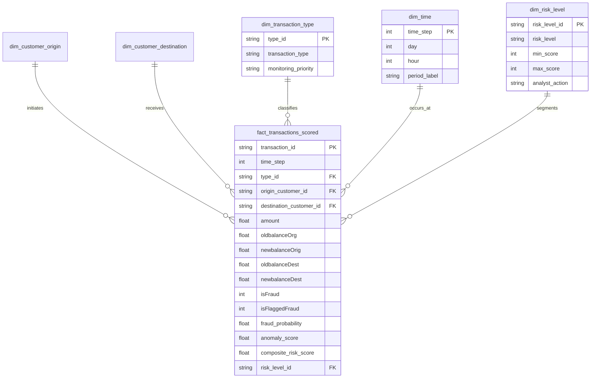

<div align="center">

# 🛡️ AML & Financial Fraud Detection Analytics

### End-to-End Anomaly Detection, Fraud Classification & Transaction Risk Scoring

<p>
  
  
  
  
</p>

<p>
  <b>230,000 transactions scored</b> · <b>113 confirmed frauds</b> · <b>0.0491% fraud rate</b> · <b>113 high/critical alerts</b>
</p>

</div>

---

## 📌 Project Overview

**AML & Financial Fraud Detection Analytics** is an end-to-end analytics and machine learning project designed to identify fraudulent financial transactions, score transaction-level risk, and support analyst escalation through BI-ready outputs.

The project combines **data cleaning**, **feature engineering**, **exploratory data analysis**, **SQL analytics**, **machine learning**, **Power BI dashboarding**, and **Excel reporting** to build a production-style fraud monitoring system.

The pipeline uses two complementary detection approaches:

1. **Random Forest Classifier** for supervised fraud prediction.
2. **Isolation Forest** for unsupervised anomaly detection.

These signals are blended into a **composite transaction risk score** and mapped to operational alert tiers.

> **Core business question:** Which transactions should be blocked, escalated, or reviewed first to reduce financial crime exposure while controlling analyst workload?

<p align="center">
  
  
</p>

### Executive KPIs

| Metric | Value |
|---|---:|
| Transactions scored | **230,000** |
| Confirmed fraudulent transactions | **113** |
| Legitimate transactions | **229,887** |
| Overall fraud rate | **0.0491%** |
| High / Critical risk alerts | **113** |
| Critical-priority cases | **86** |
| Random Forest ROC-AUC | **1.000** |
| Random Forest Recall | **1.000** |
| Random Forest Precision | **1.000** |
| Isolation Forest ROC-AUC | **0.8309** |
| Cost-optimal threshold | **0.06** |
| Pipeline runtime | **16.7 seconds** |

---

## 💼 Business Impact

This project translates raw transaction logs into a fraud-risk decision layer that can be used by risk, compliance, operations, and analytics teams.

### Key Business Outcomes

- Identified **113 confirmed fraudulent transactions** from **230,000 total transactions**.
- Managed an extremely imbalanced fraud problem with only **0.0491% fraud prevalence**.
- Achieved **100% fraud recall** on the held-out test set using engineered balance-error features.
- Flagged **113 high/critical transactions**, including **86 critical-priority cases**.
- Used threshold tuning to catch **113 of 113 frauds** while avoiding unnecessary mass alerts.
- Reduced expected fraud cost from **$56,500** if fraud were ignored to **$0** at the selected operating threshold.
- Created an analyst-friendly alerting framework for near real-time fraud triage.

<p align="center">
  
  
</p>

### KPI Alert Tiers

| Risk Tier | Rule | Business Action |
|---|---|---|
| 🔴 Critical | Risk score ≥ 75 | Page on-call fraud analyst immediately |
| 🟠 High | Risk score 50–75 | Add to priority review queue with 1-hour SLA |
| 🟡 Medium | Risk score 25–50 | Daily batch review |
| 🟢 Low | Risk score < 25 | Auto-approve and sample 1% for QA |

---

## 🧱 Project Structure

```text
AML-FRAUD-DETECTION-ANALYTICS/
│
├── data/
│   ├── raw/                          # Original transaction dataset
│   ├── processed/                    # Cleaned and feature-engineered datasets
│   └── exports/                      # Scored transactions and reporting outputs
│
├── notebooks/
│   ├── 01_data_cleaning_eda.ipynb     # Cleaning, profiling and visual EDA
│   ├── 02_feature_engineering.ipynb   # Fraud features and transaction-risk variables
│   └── 03_modeling_scoring.ipynb      # Isolation Forest, Random Forest and scoring
│
├── src/
│   ├── data_preparation.py            # Data loading and cleaning functions
│   ├── feature_engineering.py         # Balance-error and transaction features
│   ├── train_models.py                # Model training and evaluation
│   ├── score_transactions.py          # Composite risk scoring
│   └── run_pipeline.py                # End-to-end pipeline runner
│
├── sql/
│   ├── create_tables.sql              # Database objects
│   ├── analysis_queries.sql           # AML / fraud analytics queries
│   └── sql_exports/                   # Query outputs for BI and Excel
│
├── powerbi/
│   ├── DATA_MODEL.md                  # Star-schema relationships
│   ├── MEASURES.dax                   # DAX KPI measures
│   └── star_schema_exports/           # Power BI-ready fact and dimension tables
│
├── reports/
│   ├── Fraud_Detection_Report.pdf     # Executive analytics report
│   └── Fraud_Alert_Report.xlsx        # Analyst review / Excel reporting pack
│
├── models/
│   ├── random_forest_fraud.joblib      # Supervised fraud classifier
│   └── isolation_forest.joblib         # Unsupervised anomaly detector
│
├── assets/
│   └── images/                        # README and report visuals
│
├── requirements.txt
└── README.md
```

<p align="center">
  
</p>

---

## 🗄️ Database Schema — Star Schema

The project is structured as a **Power BI-ready star schema** centered on a transaction fact table.



### Why Star Schema?

- Enables fast Power BI filtering by transaction type, risk level, time, and customer/account entity.
- Keeps raw transaction behavior separate from lookup dimensions.
- Supports reusable AML KPIs and alert metrics through DAX.
- Makes SQL analytics, Excel exports, and dashboard refreshes easier to maintain.

---

## 📋 Tables at a Glance

| Table | Type | Purpose | Example Fields |
|---|---|---|---|
| `fact_transactions_scored` | Fact | Main scored transaction table | amount, transaction type, fraud probability, anomaly score, risk level |
| `dim_transaction_type` | Dimension | Transaction channel grouping | CASH_OUT, TRANSFER, PAYMENT, CASH_IN, DEBIT |
| `dim_time` | Dimension | Time and daily trend analysis | day, hour, period label |
| `dim_customer_origin` | Dimension | Origin account / sender entity | origin customer ID, account flags |
| `dim_customer_destination` | Dimension | Destination account / receiver entity | destination customer ID, merchant flag |
| `dim_risk_level` | Dimension | Alert segmentation and operational action | Low, Medium, High, Critical |
| `fact_model_metrics` | Fact / Summary | Model performance and threshold tracking | ROC-AUC, precision, recall, F1, threshold |
| `fact_alert_queue` | Fact / Output | Analyst review list | transaction ID, score, alert tier, SLA |

<p align="center">
  
  
</p>

---

## 🧹 Exploratory Data Analysis & Data Cleaning

The EDA phase focuses on understanding class imbalance, transaction behavior, amount distribution, balance movement, and channel-level fraud concentration.

### Data Cleaning Activities

- Validated transaction types: `CASH_OUT`, `TRANSFER`, `PAYMENT`, `CASH_IN`, and `DEBIT`.
- Standardized numeric columns such as transaction amount and account balances.
- Checked for missing values, duplicate records, invalid balances, and inconsistent transaction states.
- Created binary indicators for high-value transactions, zeroed-origin accounts, empty destination accounts, and merchant destinations.
- Engineered balance-error features to identify suspicious movement of funds.
- Converted time step into day / hour-style analytical fields for trend analysis.
- Prepared scored outputs for SQL, Power BI, and Excel reporting.

### Key EDA Findings

- Fraud is highly imbalanced: **113 frauds** vs **229,887 legitimate transactions**.
- Fraud appears only in **TRANSFER** and **CASH_OUT** transactions.
- **TRANSFER** has the highest fraud rate at approximately **0.306%**.
- Fraud amount distribution overlaps with legitimate transactions but shows specific high-risk balance-error patterns.
- Daily fraud counts fluctuate, supporting the need for continuous monitoring.

<p align="center">
  
  
</p>

---

## 🔁 EDA Pipeline

```mermaid
flowchart LR
    A[Raw Transaction Logs] --> B[Schema Validation]
    B --> C[Data Cleaning]
    C --> D[Class Imbalance Analysis]
    D --> E[Feature Engineering]
    E --> F[SQL Analytics Layer]
    F --> G[Model Training]
    G --> H[Composite Risk Scoring]
    H --> I[Power BI Star Schema]
    I --> J[Excel Alert Queue]
```



### Pipeline Stages

| Stage | Output |
|---|---|
| Raw ingestion | Transaction records loaded into Python and SQL |
| Validation | Data types, missing values, duplicate checks, transaction-type checks |
| Cleaning | Standardized balances, amounts, labels, and time fields |
| Feature engineering | Balance errors, high-amount flag, merchant flag, account-state indicators |
| Modeling | Random Forest fraud probability and Isolation Forest anomaly score |
| Risk scoring | Composite risk score and Low/Medium/High/Critical tier assignment |
| Reporting | Star-schema exports, Excel alert queue, PDF executive report, Power BI dashboard |

<p align="center">
  
  
</p>

---

## 🤖 Machine Learning & Risk Scoring

The detection engine uses a hybrid model design:

### 1. Supervised Fraud Classification — Random Forest

Random Forest predicts the probability that a transaction is fraudulent using engineered transaction and balance features.

### 2. Unsupervised Anomaly Detection — Isolation Forest

Isolation Forest provides an independent anomaly signal to identify unusual transaction behavior, even when fraud labels are unavailable or incomplete.

### Composite Risk Score

```text
Composite Risk Score = 70% × Fraud Probability + 30% × Normalized Anomaly Score
```

### Model Results

| Metric | Value |
|---|---:|
| Random Forest ROC-AUC | **1.000** |
| Random Forest Precision | **1.000** |
| Random Forest Recall | **1.000** |
| Random Forest Average Precision | **1.000** |
| Isolation Forest ROC-AUC | **0.8309** |
| Critical transactions | **86** |
| High / Critical transactions | **113** |

<p align="center">
  
  
</p>

<p align="center">
  
  
</p>

> **Methodology note:** Engineered balance-error features are highly predictive in this synthetic dataset, producing near-perfect separation. In real-world financial data, performance is usually lower, but the same architecture remains valid and production-ready.

---

## 🧾 SQL Analytics

The SQL analytics layer supports repeatable AML investigation, transaction monitoring, and executive reporting.

### SQL Query Themes

| Query Area | Business Purpose |
|---|---|
| Fraud by transaction type | Identify high-risk payment channels |
| High-value suspicious activity | Detect unusually large transfer and cash-out behavior |
| Daily fraud trend | Monitor fraud frequency over time |
| Risk-level segmentation | Track Low, Medium, High, and Critical transaction volumes |
| Alert queue generation | Create analyst-ready list of high/critical risk transactions |
| Balance-error analytics | Surface transactions with suspicious source/destination balance changes |

### Example SQL Query

```sql
SELECT
    transaction_type,
    COUNT(*) AS total_transactions,
    SUM(isFraud) AS fraud_transactions,
    ROUND(100.0 * SUM(isFraud) / COUNT(*), 4) AS fraud_rate_pct,
    ROUND(AVG(amount), 2) AS avg_transaction_amount
FROM fact_transactions_scored
GROUP BY transaction_type
ORDER BY fraud_rate_pct DESC;
```

<p align="center">
  
  
</p>

---

## 📊 Power BI Dashboard

The project is designed to feed an interactive Power BI fraud-monitoring dashboard.

### Recommended Dashboard Pages

| Page | Purpose | Suggested Visuals |
|---|---|---|
| Executive Overview | Monitor total transactions, fraud count, fraud rate, alerts | KPI cards, class distribution, risk distribution |
| Transaction Risk | Analyze risky transactions by channel and score | Risk tier bars, transaction-type charts, alert table |
| Fraud Behavior | Understand fraud patterns and transaction amount behavior | Fraud rate by type, amount distribution, daily trend |
| Model Performance | Track classifier and anomaly detection quality | Confusion matrix, ROC curve, PR curve, feature importance |
| Analyst Queue | Prioritize transactions for review | Critical/high transaction table, SLA status, drill-through |

### Suggested DAX Measures

```DAX
Total Transactions = COUNTROWS(fact_transactions_scored)

Fraud Transactions =
CALCULATE(
    COUNTROWS(fact_transactions_scored),
    fact_transactions_scored[isFraud] = 1
)

Fraud Rate = DIVIDE([Fraud Transactions], [Total Transactions])

Critical Alerts =
CALCULATE(
    COUNTROWS(fact_transactions_scored),
    fact_transactions_scored[risk_level] = "Critical"
)

High Critical Alerts =
CALCULATE(
    COUNTROWS(fact_transactions_scored),
    fact_transactions_scored[risk_level] IN {"High", "Critical"}
)

Average Fraud Amount =
CALCULATE(
    AVERAGE(fact_transactions_scored[amount]),
    fact_transactions_scored[isFraud] = 1
)
```

<p align="center">
  
  
</p>

---

## 📑 Reporting & Excel Integration

The reporting layer supports both executive communication and analyst operations.

### Reporting Deliverables

| Deliverable | Description |
|---|---|
| PDF Executive Report | End-to-end report covering EDA, model performance, scoring, threshold tuning, and dashboard readiness |
| Excel Alert Queue | Analyst-ready list of high and critical transactions for investigation |
| Power BI Star Schema | Fact and dimension exports for dashboard creation |
| SQL Export Tables | Repeatable query outputs for audit and compliance documentation |
| Model Artifacts | Persisted models for repeatable batch scoring |

### Excel Use Cases

- High/critical fraud alert queue.
- Analyst investigation tracker.
- Fraud trend report by day or transaction type.
- Risk tier summary for compliance review.
- Exception report for suspicious balance movements.

<p align="center">
  
  
</p>

> 📄 Full report: [`docs/Fraud_Detection_Report.pdf`](docs/Fraud_Detection_Report.pdf)

---

## 🚀 Getting Started

Follow the steps below to reproduce the analysis locally.

### 1. Clone the Repository

```bash
git clone https://github.com/rohit-bhowmick2002/Synthetic-Financial-Dataset-for-Fraud-Detection.git
cd Synthetic-Financial-Dataset-for-Fraud-Detection
```

### 2. Create a Virtual Environment

```bash
python -m venv .venv
source .venv/bin/activate      # macOS/Linux
# .venv\Scripts\activate       # Windows
```

### 3. Install Dependencies

```bash
pip install -r requirements.txt
```

### 4. Run the Fraud Pipeline

```bash
python src/run_pipeline.py
```

### 5. Run SQL Analysis

```bash
duckdb fraud_detection.duckdb < sql/analysis_queries.sql
```

### 6. Open Power BI

1. Open Power BI Desktop.
2. Import CSV exports from `powerbi/star_schema_exports/`.
3. Recreate relationships using `powerbi/DATA_MODEL.md`.
4. Paste measures from `powerbi/MEASURES.dax`.
5. Build dashboard pages using the suggested visual layout above.

---

## 🧰 Tech Stack

<div align="center">

| Category | Tools |
|---|---|
| Programming | Python |
| Data Analysis | Pandas, NumPy |
| Machine Learning | Scikit-learn, Random Forest, Isolation Forest |
| SQL Engine | DuckDB SQL |
| BI & Dashboarding | Power BI, DAX, Power Query |
| Reporting | Excel, PDF reporting |
| Visualization | Matplotlib, Seaborn |
| Model Persistence | Joblib |
| Version Control | Git, GitHub |

</div>

<p align="center">
  
  
  
  
  
  
  
</p>

---

## ❓ Key Business Questions Answered

| Business Question | Project Answer |
|---|---|
| How common is fraud in the transaction portfolio? | Fraud rate is **0.0491%**, showing extreme class imbalance. |
| How many confirmed frauds were detected? | **113** fraudulent transactions were identified. |
| Which transaction types contain fraud? | Fraud occurs in **TRANSFER** and **CASH_OUT** only. |
| Which transaction type has the highest fraud rate? | **TRANSFER** has the highest fraud rate at approximately **0.306%**. |
| How many transactions should analysts review first? | **113 high/critical transactions** should be prioritized. |
| How many transactions are critical priority? | **86 transactions** are classified as critical. |
| Which features drive fraud prediction? | `newbalanceDest`, `errorBalanceOrig`, `errorBalanceDest`, and `amtToOrigBal` are key drivers. |
| How well does the model capture fraud? | The Random Forest model achieves **100% recall** and **100% precision** on the held-out test set. |
| What operating threshold minimizes cost? | A **0.06 threshold** captures all confirmed frauds in this dataset. |
| How can BI users monitor fraud? | Through Power BI KPI cards, fraud-rate visuals, risk-tier bars, model metrics, and analyst alert queues. |

<p align="center">
  
  
</p>

---

## ✅ Additional Insights

### Fraud Pattern Insights

- Fraud is not distributed evenly across transaction channels.
- **TRANSFER** and **CASH_OUT** should receive tighter monitoring rules.
- Balance-error features provide strong fraud signal in this synthetic data environment.
- The extreme imbalance makes recall, precision, PR curve, and analyst workload more important than accuracy alone.

### Operational Risk Insights

- A small number of transactions drive the entire fraud queue.
- Risk-tiering prevents analysts from reviewing thousands of low-risk transactions.
- Threshold tuning is essential because default 0.50 cutoffs may not reflect business cost.

### Model Governance Notes

- Monitor feature drift and transaction behavior over time.
- Track false positives, false negatives, and analyst feedback.
- Recalibrate thresholds as fraud patterns change.
- Validate model performance on out-of-time samples before production use.

---

## 📌 Final Recommendations

1. Prioritize **Critical** alerts for immediate analyst review.
2. Monitor **TRANSFER** and **CASH_OUT** channels with enhanced rules.
3. Use balance-error features as core fraud indicators.
4. Track fraud-rate trends daily to detect new attack patterns.
5. Refresh Power BI dashboards after every scoring run.
6. Recalibrate the model periodically using confirmed analyst outcomes.
7. Use the **0.06 threshold** as the initial cost-sensitive operating point.

<p align="center">
  
  
</p>

---

## 👤 Author

<div align="center">

### Rohit Bhowmick

**Data Analyst | Microsoft Certified PL-300 | SQL · Python · Power BI · DAX**

<p>
  <a href="mailto:rohitbhowmick817@gmail.com"></a>
  <a href="https://www.linkedin.com/in/rohit-bhowmick"></a>
  <a href="https://github.com/rohit-bhowmick2002"></a>
</p>

</div>

---

<div align="center">

### ⭐ If this project helped you, consider starring the repository.

<b>Built to detect fraud faster, prioritize analyst workload, and convert transaction data into risk intelligence.</b>

</div>
